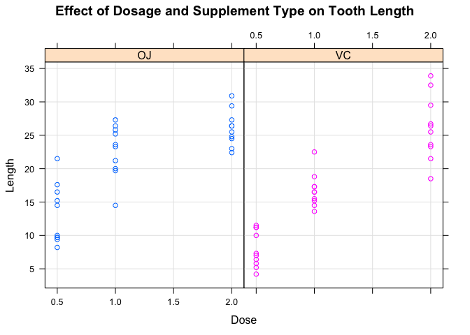

Stat540\_assignment1
================
Lisa Wei
2017-01-06

Titanic Dataset
===============

2.1 Passenger breakdown
-----------------------

``` r
## Converting Titanic array into data frame
Titanic <- data.frame(Titanic);

## Number of children on Titanic
length(which(Titanic$Age=="Child"));
```

    ## [1] 16

``` r
## Number of adults on Titanic
length(which(Titanic$Age=="Adult"))
```

    ## [1] 16

``` r
## Number of male adult passengers
males = Titanic[which(Titanic$Sex=="Male"),]
adult.males = which(males$Age=="Adult")
length(adult.males)
```

    ## [1] 8

``` r
## Number of female adult passengers
females = Titanic[which(Titanic$Sex=="Female"),]
adult.females = which(females$Age=="Adult")
length(adult.females)
```

    ## [1] 8

2.2 Survival
============

-   Question 1

``` r
child <- Titanic[which(Titanic$Age =="Child"),]
adult <- Titanic[which(Titanic$Age=="Adult"),]

## Children survival rate 
length(which(child$Survived=="Yes"))/nrow(child)
```

    ## [1] 0.5

``` r
## Adult survival rate
length(which(adult$Survived=="Yes"))/nrow(adult)
```

    ## [1] 0.5

-   Answer: Survival rates for both adult and child are the same

-   Question 2

``` r
first <- Titanic[which(Titanic$Class=="1st"),]
second <- Titanic[which(Titanic$Class=="2nd"),]
third <- Titanic[which(Titanic$Class=="3rd"),]
crew <- Titanic[which(Titanic$Class=="Crew"),]

length(which(first$Survived=="Yes"))/nrow(first)
```

    ## [1] 0.5

``` r
length(which(second$Survived=="Yes"))/nrow(second)
```

    ## [1] 0.5

``` r
length(which(third$Survived=="Yes"))/nrow(third)
```

    ## [1] 0.5

``` r
length(which(crew$Survived=="Yes"))/nrow(crew)
```

    ## [1] 0.5

-   Answer: All classes had the same survival rate of 0.5

Data Visualization
==================

-   This dataset shows the length of odentoblasts grown after being given different doses of either orange juice (OJ) or Vitamin C (VC)

``` r
Tooth<-read.table("https://raw.githubusercontent.com/STAT540-UBC/STAT540-UBC.github.io/master/homework/practice_assignment/guinea_pigs_tooth_growth.txt")

library(lattice)
xyplot(len~dose|supp, ToothGrowth, main="Effect of Dosage and Supplement Type on Tooth Length", group=supp, grid=TRUE,ylab="Length", xlab="Dose")
```

 The first graph I chose to present everything in the data as it is. I believe this is the most informative way as it doesn't hide anything or make any assumptions about the data.

The result is suggesting that the length of tooth increases with increasing dose, for both supplement types, though there is much variability in the tooth length
